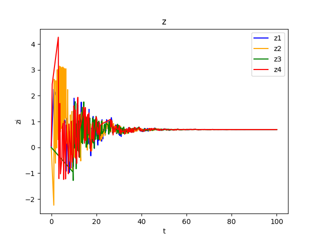

论文[Event-triggered Design for Optimal Output  Consensus of High-order Multi-agent Systems](https://arxiv.org/abs/2206.08570) c++版本的复现~

依赖Eigen库进行矩阵计算, clion编译运行.  

绘图使用matplotlib, 编译器为pycharm.  

## 代码复现

### 1. 代码结构
```bash
agent.h # agent类的头文件
agent.cpp # 对单个agent的定义, 核心代码
test.cpp # 测试函数, 用于测试单个agent的运行
main.cpp # 主函数, 对论文仿真示例的实现
```

核心部分就是UpdateController, UpdateSignalGenerator, UpdateDynamics三个函数. UpdateSignalGenerator实现upper lawer, 核心部分就是UpdateController实现lower lawer. 首先调用ShouldTrigger函数判断是否满足ETC条件, 如果满足, 则更新输入. UpdateDynamics三个函数实现agent的动力学更新.  

状态的更新采用Runge-Kutta方法, 实现方法如下:
```cpp
auto rk4 = [&](const Eigen::VectorXd& x_in) -> Eigen::VectorXd {
        return A_ * x_in + B_ * u_;
};
Eigen::VectorXd k1 = rk4(x_);
Eigen::VectorXd k2 = rk4(x_ + 0.5 * dt * k1);
Eigen::VectorXd k3 = rk4(x_ + 0.5 * dt * k2);
Eigen::VectorXd k4 = rk4(x_ + dt * k3);
x_ = x_ + (dt / 6) * (k1 + 2 * k2 + 2 * k3 + k4);
```

plot目录下为python绘图代码.
```bash
plot/plot.py # 绘图代码
plot/z.png # 仿真结果
test.py # 测试代码, 可以忽略
```

### 2. 仿真结果



效果不好, 但是可以看出, 一致性是达到了的, 收敛到0.5附近. 

### 3. 期间遇到的问题

#### 3.1 Event-triggered-control(ETC)设计死锁
起初在实现ETC逻辑时, 采用的方法是先判断是否满足ETC条件, 再判断是否需要更新输入. 这种情况会导致agent的状态不更新, 造成死锁. 也就是说, ETC条件是永远不满足的, 因为依赖agent的状态更新. 而agent状态更新的前提是ETC条件满足. 解决方法是, 引入state_new变量, 先更新状态, 再判断event-trigger条件, 如果满足条件, 则更新状态. 这样就可以避免死锁问题.  

代码中的实现如下:
```cpp
u_new_ = K1_ * x_ + K2_ * z_;
if(ShouldTriggerControl(t)) {
    u_ = u_new_;
    u_hat_ = u_;
    last_control_time_ = t;
}
```

然而, 笔者在完成此逻辑后, 不由产生了一个疑问, ETC的设计是为了减少资源消耗, 但是如果每次都更新状态, 那么不就失去了ETC的意义吗? 后面找了找资料, 仔细想了想, 大概可以这样理解: **ETC节省的是执行, 而不是观测和预测**. 观测不可避免, 获取系统状态是必需的, 但是执行是可以避免的. ETC的设计主要是为了减少执行的频率, 减少通信/执行开销.  

#### 3.2 z的更新问题

在实现z更新的逻辑时, ShouldTriggerCommunication是写错了的, 所以跑出来的结果很奇怪. 当时是判断ETC条件满足后, 更新z. 实际上应该是更新z_dot才对, 也就是z的导数. 而z的更新是整个过程都要进行的. z的更新也是采用了Runge-Kutta方法. 这个问题已经修复了. 
```cpp
auto [k1_z, k1_v] = rk4(z_, v_);
auto [k2_z, k2_v] = rk4(z_ + 0.5 * dt * k1_z, v_ + 0.5 * dt * k1_v);
auto [k3_z, k3_v] = rk4(z_ + 0.5 * dt * k2_z, v_ + 0.5 * dt * k2_v);
auto [k4_z, k4_v] = rk4(z_ + dt * k3_z, v_ + dt * k3_v);
z_dot_new_ = (1.0 / 6) * (k1_z + 2 * k2_z + 2 * k3_z + k4_z);
v_dot_new_ = (1.0 / 6) * (k1_v + 2 * k2_v + 2 * k3_v + k4_v);
if(ShouldTriggerCommunication(t)) {
    z_dot_ = z_dot_new_;
    v_dot_ = v_dot_new_;
    z_hat_ = z_;
    v_hat_ = v_;
    last_comm_time_ = t;
}
z_ += z_dot_ * dt;
v_ += v_dot_ * dt;
```
还有就是注意1.0/6的写法, 不能直接写成1/6, 否则会变成0~  

#### 3.3 参数疑问

最后得到的结果很不好, 可能是参数设置的问题, 更有可能是笔者对论文理解的不够深入, 所以部分逻辑实现错误.  

#### Agent-3

仿真结果得到z是满足一致性要求的, 但是agent-3的状态输出y却没办法收敛到z3. 暂时没有找到原因.  